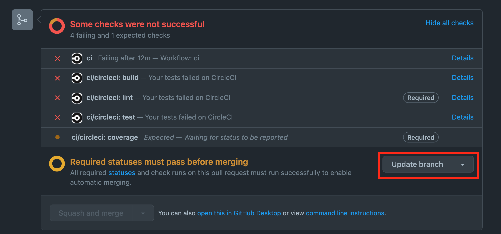
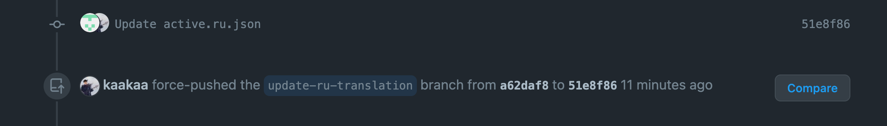

## 背景

CIが壊れてるときにPRをもらってしまい、CIがコケてCheckが通らずマージができないという事態。  
CIを直すにはCIスクリプトの方を直す必要があったので、CIを直すPRを作ってマージ。そうすると、作ってもらったPRのブランチの方にも、CIスクリプトの修正を取り込んでもらわないといけない。

「お願い〜」と言ったけど、反応がない。まぁ、時間経っちゃったので仕方ない。  
リリース作るためにマージはしちゃいたいんだけどどうしよう、というのが背景。

## 調査

### mattermod

Mattermostのリポジトリだと、PRに`/update-branch`とコメントすることで自動でbaseブランチの変更を取り込んでくれるBotとか動いてたなぁということを思い出し、リポジトリを見に行ってみる。

コードを見ると、どうも[`google/go-github`](https://github.com/google/go-github)の`UpdateBranch`という関数を実行している模様。

```go
_, resp, err := s.GithubClient.PullRequests.UpdateBranch(ctx, pr.RepoOwner, pr.RepoName, pr.Number, opt)
```
https://github.com/mattermost/mattermost-mattermod/blob/master/server/update_branch.go#L66

### `google/go-github`

`google/go-github`のgodocを見に行く。

https://pkg.go.dev/github.com/google/go-github/v45/github#PullRequestsService.UpdateBranch

GitHubのドキュメントへのリンクが貼ってある。

### GitHub API ドキュメント

`google/go-github`のgodocに載ってたドキュメントを見てみる。

https://docs.github.com/en/rest/pulls/pulls#update-a-pull-request-branch

それっぽいAPIはあるらしい。  
でもAPI叩くのはなんか嫌なので、API名でググってみる。

### GitHub　ドキュメント

やはり画面から操作できる設定がある模様。
"**Settings > Always suggest updating pull request branches**"をONにすると、なんかやりたいことができるようになるっぽい。

[Managing suggestions to update pull request branches \- GitHub Docs](https://docs.github.com/ja/repositories/configuring-branches-and-merges-in-your-repository/configuring-pull-request-merges/managing-suggestions-to-update-pull-request-branches)

一応、設定名でもググって、やりたいことに沿っていそうか確かめる。  
[Productivity Weekly \(2022\-02\-09号\)](https://zenn.dev/korosuke613/articles/productivity-weekly-20220209)

> GitHub のプルリクエスト画面で base ブランチ[1]の最新のコミットを head ブランチ[2]に取り込む「Update branch」機能が rebase を選べるようになりました。これまでは merge しか選べなかったためマージコミットができてしまっていました。

## 実施

"**Always suggest updating pull request branches**"の設定を有効にしてみると、PullRequestのところに`Update branch`というボタンが生えている。



`Update with rebase`の方を選んで`Update branch`を実行したところ、元のコミットのCo-authorとして自分が追加され、force pushされる模様。



`Update with merge commit`の方だと、自分によるマージコミットが作られるんだろうけど、どっちがいいんだろ。マージコミット作った方がわかりやすかった気がする。

## おわりに

GitHubの設定が増えすぎて全然理解が追いついてない。
