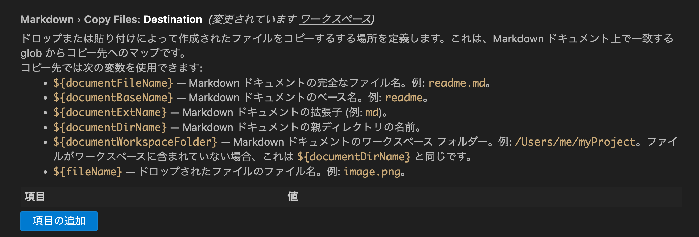

## まとめ

VS Code上でMarkdownファイルに画像ファイルを貼り付けることで、自動で画像のコピー/Markown記法の挿入ができる機能が追加されたため、自分のHugoブログに設定を追加してみたけど、あと一歩足りない感じだった。

## はじめに




VS Codeの May 2023 アップデートで、Markdownへの画像・動画の追加がドラッグ＆ドロップ、またはペーストだけで出来るようになったらしい。

[Visual Studio Code May 2023](https://code.visualstudio.com/updates/v1_79#_copy-external-media-files-into-workspace-on-drop-or-paste-for-markdown)
> Copy external media files into workspace on drop or paste for Markdown

今まで、画像や動画ファイルを追加する場合は、まずVS Codeのエクスプローラーにファイルをドラッグ&ドロップするなどしてファイルシステムの特定の場所に画像・動画ファイルを置き、その画像ファイルを参照するMarkdown記法 (``)を手作業で書いていたが、この機能を使えばその辺りの手間が省けそうに思えた。  
ブログやSlidevででMarkdown + 画像・動画ファイルという組み合わせは多く扱っていたが、常に画像ファイルの取り扱いが難儀だったので、この辺りが省力ができるととても嬉しい。  

## やってみた
VS Code v1.79.2を使用して検証。

何も設定がない場合、Markdownファイルにペーストした画像ファイルはMarkdownファイルと同じ場所に`image.png`, `image-1.png`,`image-2.png`,...という名前で作成される。そしてペーストした箇所に ``というテキストが挿入される。  
ドラッグ&ドロップの場合は、VS Code上のMarkdownファイルにShiftを押しながらドロップすることでファイルがコピーされる(Shiftを押さずにドロップすると、普通にVS Codeで画像ファイルを開くという動きになる)。また、ドラッグ&(Shift+)ドロップによりファイルをコピーした場合は、コピーしたファイル名がそのまま使われる。

Hugoでは、Markdown原稿は`content/`配下に、画像などの静的ファイルは`static/`配下に配置するというお作法のようなものがあり、自分のブログもそれに従っているため、Markdownファイルと同じディレクトリに画像ファイルが作成されると後でディレクトリを移動する必要があり多少の面倒が残る。  

例えば以下のような構成。

```
.
├── content
│   └── post
│       └── document.md
└── static
    └── images
        └── post
            └── document
                └── image.png
```

このような場合、画像ファイルをペーストした時は、`document.md`と同じディレクトリではなく、`static/images/post/document`配下に画像ファイルを作成して欲しい。

このような要求を満たすため、ペーストされた画像ファイルのコピー先を指定する`markdown.copyFiles.destination`という設定が使えるようになっている。

```.vscode/settings.json
{
    "markdown.copyFiles.destination": {
        "content/post/*": "/static/images/posts/${documentBaseName}/"
    }
}
```

`markdown.copyFiles.destination`の設定では、keyがこの設定が有効になるMarkdownファイルのパスを表し、value側がそのMarkdownファイルに画像がペースト(or ドロップ)された場合のコピー先を表している。  

この設定例では、`content/post/`配下に置かれたMarkdownファイルに画像ファイルがペーストされると、`static/images/posts/`配下にMarkdownファイルと同名のフォルダを自動で作成し、ペーストされたファイルをその作成されたフォルダ配下に生成してくれる。

仕様として明記されていないような気もするが、コピー先を`/`で始めると、開いているVS CodeのWorkspaceのルートからのパスを指定できる。`/`で始めないと、Markdownファイルが置いてあるディレクトリのパスがコピー先設定のルートになる。

また、コピー先のパスに `${documentBaseName}` という変数が使われているが、使用可能な変数については、VS Codeの当該設定の説明で確認できる。


ただ、この設定、変数を使った時の挙動が分かりづらい(特に`documentWorkspaceFolder`あたり)上に、VS Codeで開いているワークスペースより上位の階層にもファイルを作りにいってしまうっぽいので (流石にドライブルート直下に作成はしなかったようだが) 設定する際は注意した方が良いと思う。

## 懸念点

上記の対応を行うことでそれっぽい動きはするようになったが、まだまだ色々と気になる点が残る。

### Markdownで参照する画像ファイルの場所が相対パスになる

挿入されるMarkdown記法における画像の参照先は以下のような相対リンクになる。

```

```

挿入されるMarkdown記法の設定は行えず、上記をそのままHugoでビルドしてもデプロイ先とパスが異なるために画像ファイルが表示されないので、この部分は書き換える必要がある。  
Hugoブログだと、Build/Deploy後のパスを意識しながら参照させる必要があるため、この部分は任意の設定ができないと上手く扱えない気がしている。

### スクショをペーストした場合に作成されるファイル名が `image` 固定

ブログで何かしらの画面を紹介する際、スクリーンショット撮ってブログに貼り付けるというのを多用するが、Markdownにスクリーンショットをペーストすると、ファイルのベース名が `image` 固定になってしまう。  
クリティカルな問題ではないが、後から画像を差し替えたいと思った時の認知負荷が高そうで好ましくない。ファイル名をつけたい場合は、一旦ローカルで名前を変えてからドラッグ&ドロップするか、一旦ペーストしてからVS Code上でファイル名変更するかなので、何だかそんなに楽になった感じがしない。

# まとめ

スクリーンショットをブログに貼る場合は以下のように変わりそう。

* 修正前
  1. スクショ撮る (ファイル保存)
  2. ローカルでファイル名を変える
  3. [VS Code] `static` フォルダ内にブログエントリに対応するフォルダを作る
  4. [VS Code] `3.` で作成したフォルダに画像ファイルを保存する
  5. [VS Code] Markdownファイルに画像を参照する記述を行う

* 導入後
  1. スクショ撮る (クリップボード保存)
  2. [VS Code] Markdownファイルにペーストする
  3. [VS Code] 格納された画像ファイルの名前を変更する
  4. [VS Code] 挿入されたMarkdown記法の画像参照先(とAltテキスト)を修正する

導入後の手順で、Markdownファイル上で画像の参照先を編集するのはある程度受け入れられるが、`3.`の画像のファイル名を変更する部分が手順としては煩雑に感じる。  
もうファイル名は気にしないという判断を取れば幸せに近づく気がしてきた。(何十ものファイルがあるわけでもないし)

今までブログエントリのファイル名で、そのエントリ専用のフォルダ切ってたりする手順が無くなるのは良いのかもしれない。

最初知った時は「神機能!」と思ったけど、使ってみたら「後一歩」という感じだった。
